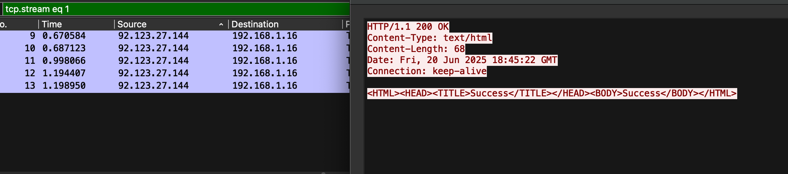

# 802.11Decrypter

A Go-based tool for capturing and decrypting WPA2 network traffic. This tool automates the process of capturing EAPOL handshakes and subsequent network traffic for specified MAC addresses.

## Prerequisites

- Go 1.23 or later
- `aircrack-ng` installed and in PATH
- `tcpdump` installed
- `iwconfig` installed
- Root/sudo privileges (required for network interface manipulation)

## Installation

```bash
# Clone the repository
git clone https://github.com/litemars/802.11Decrypter.git

# Change into the project directory
cd 802.11Decrypter

# Install the package
go install
```

## Building

```bash
# Clone the repository
git clone https://github.com/litemars/802.11Decrypter.git

# Change into the project directory
cd 802.11Decrypter

# Install the package
go build -o 802.11Decrypter
```

## Usage

```bash
802.11Decrypter <interface> <channel> <ssid> <passphrase> <mac_address1,mac_address2,...>
```

### Parameters:

- `interface`: Network interface to use (must support monitor mode)
- `channel`: WiFi channel to monitor
- `ssid`: Network SSID
- `passphrase`: Network passphrase
- `mac_addresses`: Comma-separated list of MAC addresses to monitor

### Example:

```bash
sudo 802.11Decrypter wlan0 6 MyNetwork mypassword 00:11:22:33:44:55,66:77:88:99:AA:BB
```

## Features

- Automatic monitor mode configuration
- Channel setting for targeted capture
- Concurrent monitoring of multiple MAC addresses
- EAPOL handshake detection
- Automatic traffic capture and decryption
- Uses standard tools (tcpdump, aircrack-ng)

## How it Works

1. Sets the specified interface to monitor mode
2. Configures the interface to the specified channel
3. Starts capturing traffic for each specified MAC address
4. Detects EAPOL handshakes
5. Continues capturing traffic for 10 minutes after handshake detection
6. Decrypts captured traffic using the provided network credentials

## Output

The tool creates PCAP files for each captured session in the format:
```
capture_[MAC]_[TIMESTAMP].pcap
capture_[MAC]_[TIMESTAMP]-dec.pcap
```

You can now decrypt all the traffic in your network - e.g., my iphone is pinging this service every time the an interent connection is established.





## License

This project is licensed under the MIT License - see the [LICENSE](LICENSE) file for details.

## Contributing

Contributions are welcome! Please feel free to submit a Pull Request.

## Security Note

This tool should only be used on networks you own or have explicit permission to test. Unauthorized network monitoring may be illegal in your jurisdiction.


## Example Hardware Setup

This project uses a Raspberry Pi 3 with two Wi-Fi interfaces: one built-in (used for SSH access), and an additional USB Wi-Fi adapter (used for traffic monitoring via the Go module).
